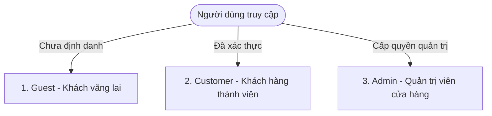
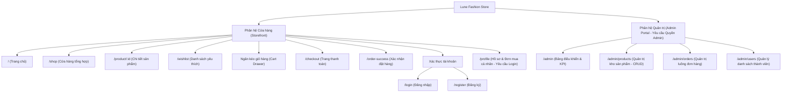
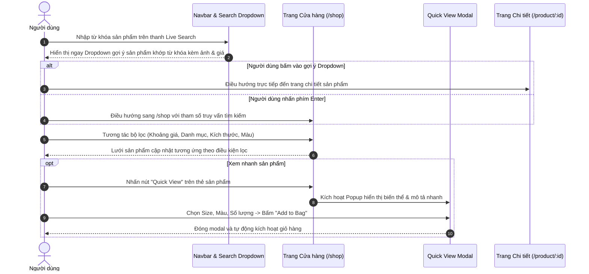
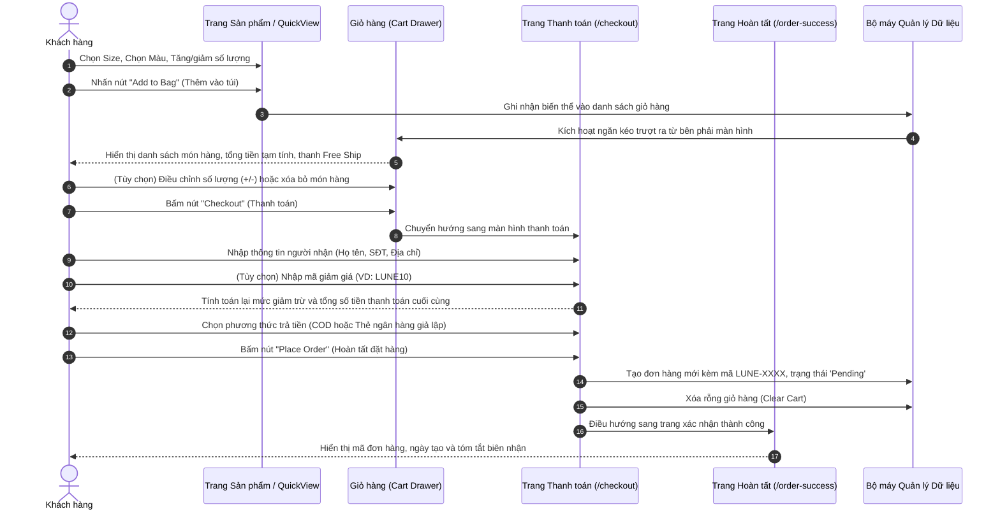
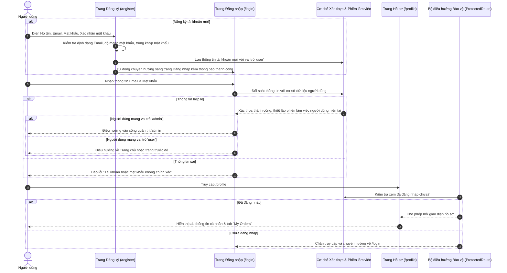
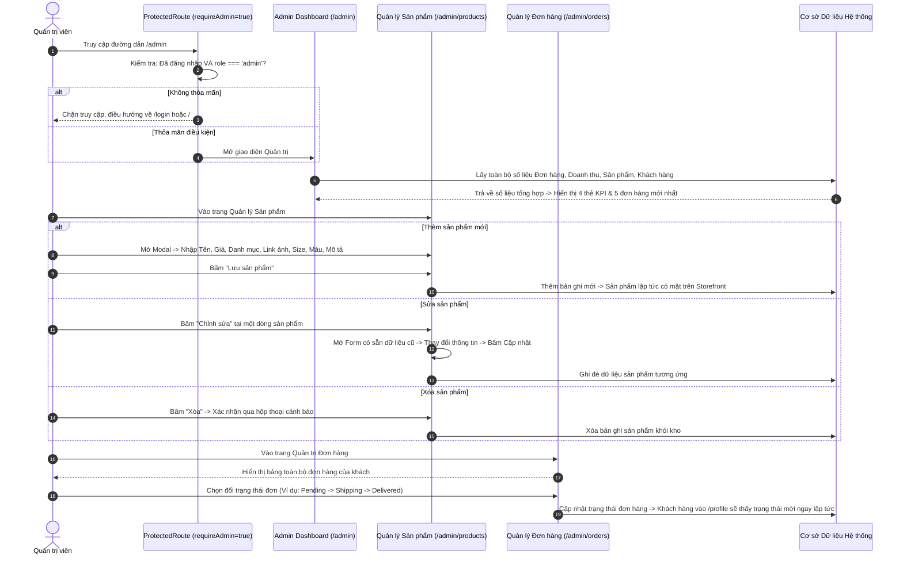

# 📑 TÀI LIỆU PHÂN TÍCH HỆ THỐNG CHI TIẾT
# DỰ ÁN: LUNE FASHION STORE (E-COMMERCE SYSTEM)

---

## 📌 I. TỔNG QUAN HỆ THỐNG (SYSTEM OVERVIEW)

### 1. Giới thiệu dự án
**Lune Fashion Store** là nền tảng thương mại điện tử chuyên biệt cho ngành hàng thời trang may mặc và phụ kiện cao cấp. Hệ thống được xây dựng theo phong cách tối giản hiện đại (Minimalism & Luxury), mang lại trải nghiệm mua sắm liền mạch, trực quan cho người tiêu dùng đồng thời cung cấp công cụ quản trị vận hành mạnh mẽ, chính xác cho chủ cửa hàng.

### 2. Mục tiêu hệ thống
* **Về phía người dùng:** Cung cấp trải nghiệm tìm kiếm, chọn lọc sản phẩm thông minh, giỏ hàng tương tác nhanh (Slide-in Cart Drawer), đặt hàng tinh gọn, theo dõi trạng thái đơn hàng tức thời.
* **Về phía quản trị:** Cung cấp bức tranh trực quan về số liệu kinh doanh (KPI Dashboard), quản lý vòng đời sản phẩm (Toàn chu trình CRUD), kiểm soát và điều phối trạng thái đơn hàng, theo dõi danh sách khách hàng.
* **Về mặt kỹ thuật nghiệp vụ:** Phân tách rõ ràng giữa phân hệ Khách hàng (Storefront) và phân hệ Quản trị (Admin Portal), bảo đảm tính toàn vẹn và tính liên tục của dữ liệu nghiệp vụ.

---

## 👥 II. TÁC NHÂN HỆ THỐNG (SYSTEM ACTORS)

Hệ thống xác định 3 tác nhân chính tham gia vào quy trình nghiệp vụ với các quyền hạn và phạm vi tác động cụ thể:

### 1. Khách vãng lai (Guest)
* **Định nghĩa:** Bất kỳ người dùng nào truy cập vào trang web mà chưa thực hiện đăng nhập hoặc chưa có tài khoản trong hệ thống.
* **Phạm vi quyền hạn:**
  * Khám phá toàn bộ giao diện công khai (Trang chủ, Bộ sưu tập, Cửa hàng tổng hợp, Chi tiết sản phẩm).
  * Sử dụng các bộ công cụ tra cứu: Live Search, bộ lọc đa thuộc tính, sắp xếp giá, xem nhanh (Quick View), xem bảng hướng dẫn chọn kích cỡ (Size Guide).
  * Thao tác trên giỏ hàng tạm thời và danh sách yêu thích lưu cục bộ trên trình duyệt.
  * Có thể tiến hành đặt hàng thông qua hình thức nhập thông tin trực tiếp tại trang thanh toán mà không bắt buộc phải tạo tài khoản trước.
* **Giới hạn:** Không thể xem lịch sử mua hàng cá nhân, không thể quản lý sổ địa chỉ tích hợp, không có quyền truy cập vào phân hệ Admin.

### 2. Khách hàng thành viên (Customer / Registered User)
* **Định nghĩa:** Người dùng đã hoàn tất đăng ký tài khoản hợp lệ và đăng nhập thành công vào hệ thống với vai trò `user`.
* **Phạm vi quyền hạn:**
  * Kế thừa toàn bộ quyền hạn của **Guest**.
  * Sở hữu không gian cá nhân (Profile Page): Xem, cập nhật thông tin cá nhân (Họ tên, Số điện thoại, Email, Mật khẩu).
  * **Quản lý đơn hàng cá nhân (My Orders):** Theo dõi danh sách đơn hàng do chính tài khoản tạo ra, xem chi tiết từng món đồ đã mua, chi phí và trạng thái đơn hàng theo thời gian thực (`Pending` -> `Shipping` -> `Delivered` -> `Cancelled`).
  * Danh sách yêu thích (Wishlist) và giỏ hàng được gắn liền với tài khoản phiên đăng nhập.
* **Giới hạn:** Bị chặn hoàn toàn quyền truy cập vào cổng quản trị (`/admin`). Mọi hành vi cố tình truy cập URL nội bộ này sẽ bị hệ thống điều hướng bảo vệ chặn lại.

### 3. Quản trị viên (Administrator / Store Manager)
* **Định nghĩa:** Nhân sự quản lý hệ thống được cấp tài khoản đặc quyền với vai trò `admin`.
* **Phạm vi quyền hạn:**
  * Toàn quyền truy cập và kiểm soát phân hệ quản trị (`/admin`).
  * **Tổng quan điều hành (Dashboard):** Xem thống kê doanh thu tích lũy, tổng số lượng đơn hàng, số mã sản phẩm hiện có và số lượng người dùng trong hệ thống; duyệt danh sách 5 đơn hàng mới nhất cần xử lý.
  * **Quản lý sản phẩm (Product Catalog Management):** Khởi tạo sản phẩm mới, cập nhật giá/hình ảnh/mô tả/danh mục/kích cỡ, xóa bỏ sản phẩm khỏi hệ sinh thái bán lẻ.
  * **Quản lý đơn hàng (Order Fulfillment):** Xem tất cả đơn hàng phát sinh trên toàn hệ thống, cập nhật tiến trình đơn hàng (Chuyển trạng thái: Chờ xử lý $\rightarrow$ Đang giao hàng $\rightarrow$ Giao thành công hoặc Hủy đơn).
  * **Quản lý khách hàng (Customer Management):** Tra cứu danh sách thành viên, ngày tham gia, thông tin liên hệ.
  * Vẫn có thể trải nghiệm mua sắm ở giao diện khách hàng bình thường nếu cần kiểm thử luồng thực tế.

---

## 🗺️ III. SƠ ĐỒ CẤU TRÚC TRANG (SITEMAP & NAVIGATION ARCHITECTURE)

Hệ thống được tổ chức thành 2 phân hệ hoàn chỉnh và độc lập về mặt trải nghiệm:

### 1. Kiến trúc phân hệ Khách hàng (Storefront)
| Đường dẫn (Route) | Tên màn hình / Chức năng | Mô tả vai trò kiến trúc | Tác nhân truy cập |
| :--- | :--- | :--- | :--- |
| `/` | **Trang chủ (Home Page)** | Trưng bày bộ sưu tập mới (Hero Carousel), danh mục nổi bật, sản phẩm New Arrivals, chính sách dịch vụ, đăng ký nhận bản tin thời trang. | Mọi đối tượng |
| `/shop` | **Cửa hàng (Shop Catalog)** | Không gian duyệt toàn bộ danh mục sản phẩm kết hợp bộ lọc thuộc tính đa chiều (Giá, Danh mục, Size, Màu) và phân trang. | Mọi đối tượng |
| `/product/:id` | **Chi tiết sản phẩm (Product Detail)** | Khảo sát thông số chi tiết của một mặt hàng cụ thể, thư viện ảnh phóng to, lựa chọn biến thể (Size/Màu), bảng tư vấn số đo. | Mọi đối tượng |
| `/wishlist` | **Yêu thích (Wishlist)** | Danh sách các sản phẩm được người dùng lưu lại quan tâm, hỗ trợ chuyển nhanh vào giỏ hàng ("Move to Bag"). | Mọi đối tượng |
| `Global Drawer` | **Ngăn kéo giỏ hàng (Cart Drawer)** | Cửa sổ trượt bên phải hiển thị trạng thái giỏ hàng tức thì, thanh tiến độ miễn phí vận chuyển, nút chuyển thẳng sang thanh toán. | Mọi đối tượng |
| `/checkout` | **Thanh toán (Checkout)** | Điền thông tin giao hàng, áp dụng mã khuyến mãi (Coupon/Voucher), lựa chọn phương thức thanh toán và kiểm tra tóm tắt tài chính. | Mọi đối tượng |
| `/order-success` | **Đặt hàng thành công** | Màn hình hiển thị mã đơn hàng chính thức, tóm tắt các sản phẩm đã mua và lời cảm ơn từ thương hiệu. | Mọi đối tượng |
| `/login` | **Đăng nhập (Sign In)** | Cổng định danh người dùng vào hệ thống bằng tài khoản và mật khẩu đã tạo. | Mọi đối tượng |
| `/register` | **Đăng ký (Sign Up)** | Màn hình đăng ký thành viên mới với các quy tắc xác thực biểu mẫu đầy đủ. | Mọi đối tượng |
| `/profile` | **Hồ sơ cá nhân (Account Profile)** | Bảng điều khiển tài khoản: cập nhật hồ sơ, đổi mật khẩu và theo dõi lịch sử đơn hàng cá nhân ("My Orders"). | Thành viên đã đăng nhập |

### 2. Kiến trúc phân hệ Quản trị (Admin Portal)
| Đường dẫn (Route) | Tên màn hình / Chức năng | Mô tả vai trò kiến trúc | Điều kiện bảo vệ |
| :--- | :--- | :--- | :--- |
| `/admin` | **Admin Dashboard** | Màn hình trung tâm hiển thị 4 chỉ số KPI then chốt (Doanh thu, Đơn hàng, Tồn kho, Thành viên) và danh sách 5 đơn hàng mới nhất cần duyệt. | Chỉ tài khoản `role: admin` |
| `/admin/products` | **Quản lý sản phẩm (Products)** | Bảng dữ liệu sản phẩm, tìm kiếm nội bộ, modal Thêm mới sản phẩm, form Sửa thông tin và thao tác Xóa sản phẩm khỏi kho. | Chỉ tài khoản `role: admin` |
| `/admin/orders` | **Quản lý đơn hàng (Orders)** | Toàn bộ danh sách đơn đặt hàng từ khách, công cụ thay đổi trạng thái đơn hàng (`Pending` -> `Shipping` -> `Delivered` -> `Cancelled`). | Chỉ tài khoản `role: admin` |
| `/admin/users` | **Quản lý thành viên (Users)** | Danh mục người dùng đã đăng ký tài khoản trong hệ sinh thái, phân loại cấp bậc tài khoản (`admin` / `user`). | Chỉ tài khoản `role: admin` |

---

## 🔄 IV. LUỒNG NGƯỜI DÙNG CHI TIẾT (USER FLOWS)

### 1. Luồng Khám phá & Tìm kiếm sản phẩm (Discovery & Search Flow)

* **Mô tả nghiệp vụ:**
  1. Người dùng có thể tìm kiếm ở bất kỳ trang nào thông qua thanh tìm kiếm trực tiếp trên thanh điều hướng (`Navbar`).
  2. Kết quả gợi ý xuất hiện theo thời gian thực (Real-time live search).
  3. Khi cần khảo sát chuyên sâu, người dùng vào `/shop` để áp dụng các tiêu chí kết hợp: Ví dụ: Chọn danh mục *Women* + Giá từ *$100 - $250* + Size *M* + Sắp xếp theo *Mới nhất*.

---

### 2. Luồng Mua sắm & Thanh toán (Shopping & Checkout Flow)

* **Các quy tắc nghiệp vụ quan trọng:**
  * **Kiểm tra giỏ rỗng:** Không cho phép truy cập hoặc nhấn đặt hàng nếu giỏ hàng có 0 sản phẩm.
  * **Thanh tiến độ Free Shipping:** Hiển thị mức tiền còn thiếu để đạt hạn mức miễn phí vận chuyển (Ví dụ: Đạt từ $200 trở lên được miễn phí ship $15).
  * **Hợp nhất biến thể:** Nếu khách thêm cùng một sản phẩm với cùng Size và Màu, hệ thống tăng số lượng (`quantity`) chứ không tạo bản ghi mới trùng lặp.
  * **Mã giảm giá:** Kiểm tra tính hợp lệ của mã khuyến mãi (Ví dụ mã giảm 10%), tự động tính toán lại số tiền chiết khấu trước khi chốt tổng hóa đơn.

---

### 3. Luồng Xác thực & Quản trị hồ sơ (Authentication & Profile Flow)

---

### 4. Luồng Nghiệp vụ Quản trị viên (Admin Management Flow)

---

## 📋 V. BẢNG PHÂN RÃ CHỨC NĂNG CHI TIẾT (FUNCTIONAL REQUIREMENTS)

### 1. Phân hệ Khách vãng lai (Guest)

| Mã yêu cầu | Tên chức năng | Mô tả chi tiết nghiệp vụ | Điều kiện kích hoạt / Tiền đề | Kết quả mong đợi |
| :--- | :--- | :--- | :--- | :--- |
| **G-01** | Xem Banner & Bộ sưu tập | Hiển thị Banner chuyển động đa ảnh, các bộ sưu tập theo mùa, danh mục nổi bật (Women, Men, Accessories). | Người dùng vào trang chủ `/`. | Trình diễn giao diện thẩm mỹ cao, tự động chuyển slide hoặc bấm chuyển thủ công. |
| **G-02** | Xem danh mục sản phẩm | Hiển thị danh sách sản phẩm theo dạng lưới (Grid 3-4 cột) với ảnh chính, tên, giá, nhãn "New". | Vào `/shop` hoặc cuộn xuống phần sản phẩm ở trang chủ. | Bố cục đều đặn, ảnh sắc nét, responsive trên mobile/tablet. |
| **G-03** | Tìm kiếm sản phẩm trực tiếp | Nhập từ khóa vào ô Search trên thanh Navbar, tự động lọc và gợi ý danh sách sản phẩm khớp tên kèm ảnh thu nhỏ và giá. | Gõ ký tự vào ô tìm kiếm. | Xuất hiện dropdown gợi ý tức thì; nhấn Enter chuyển sang `/shop?search=...`. |
| **G-04** | Bộ lọc sản phẩm đa chiều | Lọc danh sách sản phẩm đồng thời theo: Khoảng giá ($0-$100, $100-$250, $250+), Danh mục (Women/Men/Accessories), Size, Màu sắc. | Thao tác trên sidebar lọc tại `/shop`. | Danh sách sản phẩm lập tức cập nhật chỉ hiển thị các mặt hàng thỏa mãn tất cả tiêu chí. |
| **G-05** | Sắp xếp sản phẩm | Sắp xếp thứ tự hiển thị: Giá tăng dần, Giá giảm dần, Mới nhất (Newest). | Chọn tiêu chí từ thanh dropdown Sắp xếp. | Danh sách sản phẩm tái sắp xếp ngay lập tức mà không cần reload trang. |
| **G-06** | Xem chi tiết sản phẩm | Xem đầy đủ thông tin: Thư viện ảnh góc cạnh, mô tả chất liệu, bảng hướng dẫn chọn kích cỡ (Size Guide), giá tiền. | Nhấp vào thẻ sản phẩm bất kỳ. | Điều hướng tới `/product/:id`, hiển thị ảnh lớn và danh sách thumbnail có thể click chuyển đổi. |
| **G-07** | Xem nhanh (Quick View) | Mở popup xem thông số sản phẩm và chọn mua trực tiếp ngay tại trang danh mục mà không cần rời màn hình hiện tại. | Nhấp biểu tượng "Quick View" trên thẻ sản phẩm. | Modal hiển thị đầy đủ thông tin biến thể và nút "Add to Bag". |
| **G-08** | Quản lý Giỏ hàng (Cart Drawer) | Xem danh sách món hàng trong giỏ, tăng/giảm số lượng từng món, xóa món hàng, xem tổng tiền và mức tiền còn thiếu để được Free Ship. | Bấm icon Giỏ hàng trên Navbar hoặc sau khi nhấn "Add to Bag". | Ngăn kéo trượt mượt mà từ cạnh phải, tự động tính toán tổng số tiền theo thời gian thực. |
| **G-09** | Quản lý Yêu thích (Wishlist) | Thả tim sản phẩm để lưu vào danh sách quan tâm; xem trang `/wishlist`; chuyển món hàng từ Wishlist vào Giỏ hàng. | Bấm icon Trái tim trên ảnh sản phẩm hoặc vào `/wishlist`. | Icon tim đổi trạng thái kích hoạt; trang `/wishlist` hiển thị đầy đủ các sản phẩm đã lưu. |
| **G-10** | Đặt hàng không cần tài khoản | Điền thông tin người nhận (Họ tên, SĐT, Địa chỉ), áp dụng mã giảm giá, chọn phương thức thanh toán và chốt đơn. | Bấm "Checkout" từ Giỏ hàng. | Đơn hàng được tạo thành công, cấp mã `LUNE-XXXX`, giỏ hàng tự động làm sạch. |
| **G-11** | Đăng ký nhận bản tin | Nhập email tại chân trang (Footer) để nhận thông tin ưu đãi từ thương hiệu. | Nhập email và bấm nút gửi tại Footer. | Kiểm tra tính hợp lệ của định dạng email; hiển thị thông báo thành công. |

---

### 2. Phân hệ Khách hàng thành viên (Customer / User)

| Mã yêu cầu | Tên chức năng | Mô tả chi tiết nghiệp vụ | Điều kiện kích hoạt / Tiền đề | Kết quả mong đợi |
| :--- | :--- | :--- | :--- | :--- |
| **C-01** | Đăng ký tài khoản | Nhập Họ tên, Địa chỉ Email, Mật khẩu và Nhập lại mật khẩu để tạo tài khoản mới. | Truy cập `/register`. | Kiểm tra tính hợp lệ dữ liệu (Email không trùng lặp, mật khẩu tối thiểu 6 ký tự), lưu người dùng mới vào hệ thống. |
| **C-02** | Đăng nhập hệ thống | Nhập Email và Mật khẩu đã đăng ký để xác thực danh tính người dùng. | Truy cập `/login`. | Xác thực thành công: Ghi nhận phiên làm việc, thanh Navbar hiển thị tên và avatar người dùng. |
| **C-03** | Đăng xuất tài khoản | Hủy phiên làm việc hiện tại, đưa trạng thái hệ thống về Khách vãng lai (Guest). | Bấm nút "Logout" tại menu tài khoản. | Xóa phiên đăng nhập, điều hướng an toàn về Trang chủ. |
| **C-04** | Quản lý Hồ sơ cá nhân | Xem và cập nhật thông tin cá nhân: Đổi họ tên, số điện thoại, cập nhật mật khẩu mới. | Đã đăng nhập, truy cập `/profile` -> Tab "Hồ sơ". | Lưu thông tin cập nhật mới vào dữ liệu tài khoản, hiển thị thông báo thành công. |
| **C-05** | Lịch sử Đơn mua (My Orders) | Theo dõi toàn bộ danh sách đơn hàng đã từng đặt bởi chính tài khoản này; hiển thị mã đơn, ngày mua, tổng tiền và trạng thái hiện tại. | Đã đăng nhập, truy cập `/profile` -> Tab "Đơn hàng của tôi". | Hiển thị bảng đơn hàng trực quan kèm nhãn màu trạng thái (`Pending`: Vàng, `Shipping`: Xanh lam, `Delivered`: Xanh lá, `Cancelled`: Đỏ). |
| **C-06** | Kế thừa giỏ hàng & Yêu thích | Giữ nguyên các mặt hàng đã chọn trong giỏ hàng và danh sách yêu thích gắn liền với phiên làm việc của người dùng. | Đăng nhập tài khoản. | Dữ liệu giỏ hàng và yêu thích không bị mất đi khi chuyển đổi qua lại giữa các trang. |

---

### 3. Phân hệ Quản trị viên (Admin)

| Mã yêu cầu | Tên chức năng | Mô tả chi tiết nghiệp vụ | Điều kiện kích hoạt / Tiền đề | Kết quả mong đợi |
| :--- | :--- | :--- | :--- | :--- |
| **A-01** | Bảng số liệu tổng quan (Dashboard) | Tổng hợp và hiển thị 4 chỉ số thống kê quan trọng: Doanh thu thực tế, Tổng số đơn hàng, Tổng mã sản phẩm trong kho, Tổng số thành viên. | Đăng nhập với quyền `admin`, truy cập `/admin`. | Hiển thị các khối thẻ KPI số liệu trực quan, tỷ lệ tăng trưởng và danh sách 5 đơn hàng mới nhất phát sinh. |
| **A-02** | Xem danh mục sản phẩm (Read) | Hiển thị toàn bộ danh sách sản phẩm trong kho theo dạng bảng quản trị: Ảnh đại diện, Tên sản phẩm, Giá niêm yết, Danh mục, Thao tác. | Truy cập `/admin/products`. | Bảng dữ liệu có thanh tìm kiếm nội bộ để tra cứu nhanh theo tên sản phẩm. |
| **A-03** | Thêm sản phẩm mới (Create) | Mở form/modal nhập liệu sản phẩm mới gồm: Tên, Giá, Danh mục (Women/Men/Accessories), Link ảnh chính, Mảng ảnh phụ, Kích cỡ, Màu sắc, Mô tả. | Bấm nút "Thêm sản phẩm mới" tại `/admin/products`. | Kiểm tra tính hợp lệ biểu mẫu (không để trống trường bắt buộc). Bấm "Lưu" -> Sản phẩm xuất hiện ngay lập tức trên cả Admin và Storefront. |
| **A-04** | Sửa sản phẩm (Update) | Tải lại toàn bộ dữ liệu hiện tại của sản phẩm được chọn lên form chỉnh sửa để Quản trị viên thay đổi giá tiền, tiêu đề, ảnh hoặc mô tả. | Bấm nút "Sửa" tại dòng sản phẩm tương ứng. | Dữ liệu cũ được tải chính xác lên form; bấm "Cập nhật" -> Dữ liệu mới lập tức đồng bộ toàn hệ thống. |
| **A-05** | Xóa sản phẩm (Delete) | Loại bỏ vĩnh viễn một sản phẩm ra khỏi danh mục kinh doanh của cửa hàng kèm hộp thoại xác nhận an toàn (Confirm Dialog). | Bấm nút "Xóa" tại dòng sản phẩm tương ứng. | Hiển thị cảnh báo: *"Bạn có chắc chắn muốn xóa sản phẩm này không?"*. Sau khi xác nhận, sản phẩm bị xóa khỏi cơ sở dữ liệu. |
| **A-06** | Quản lý danh sách Đơn hàng | Hiển thị bảng tổng hợp tất cả đơn hàng của mọi khách hàng trong hệ thống: Mã đơn, Tên người nhận, SĐT, Ngày tạo, Tổng tiền, Trạng thái. | Truy cập `/admin/orders`. | Bảng danh sách hỗ trợ lọc theo trạng thái và tìm kiếm mã đơn hàng. |
| **A-07** | Cập nhật tiến độ Đơn hàng | Cho phép Admin chuyển đổi trạng thái vòng đời của đơn hàng: `Pending` (Chờ duyệt) $\rightarrow$ `Shipping` (Đang giao hàng) $\rightarrow$ `Delivered` (Đã giao thành công) hoặc `Cancelled` (Hủy đơn). | Chọn trạng thái mới từ danh sách dropdown hoặc nút bấm tại đơn hàng. | Trạng thái cập nhật tức thời; tài khoản khách đặt đơn hàng đó sẽ nhìn thấy trạng thái mới khi kiểm tra hồ sơ cá nhân. |
| **A-08** | Quản lý danh sách Thành viên | Hiển thị danh sách toàn bộ người dùng đã đăng ký tài khoản trong hệ thống: Họ tên, Email, Vai trò (`admin` / `user`). | Truy cập `/admin/users`. | Cung cấp cái nhìn tổng quan về quy mô người dùng đăng ký của cửa hàng. |

---

## 🔐 VI. MA TRẬN PHÂN QUYỀN HỆ THỐNG (RBAC AUTHORIZATION MATRIX)

Ký hiệu:
* **FULL**: Toàn quyền xem, khởi tạo, cập nhật, xóa bỏ.
* **READ**: Chỉ có quyền xem dữ liệu.
* **OWN**: Chỉ có quyền thao tác trên dữ liệu do chính mình tạo ra.
* **DENIED**: Bị từ chối truy cập hoàn toàn (Hệ thống chặn hoặc ẩn giao diện).

| Khu vực / Nghiệp vụ chức năng | Khách vãng lai (Guest) | Khách thành viên (Customer) | Quản trị viên (Admin) |
| :--- | :---: | :---: | :---: |
| **Xem Trang chủ, Sản phẩm, Chi tiết, Giới thiệu** | READ | READ | READ |
| **Tìm kiếm Live Search & Bộ lọc đa thuộc tính** | READ | READ | READ |
| **Thêm hàng vào Giỏ, Tăng giảm số lượng** | OWN | OWN | OWN |
| **Yêu thích sản phẩm (Wishlist)** | OWN | OWN | OWN |
| **Thực hiện Đặt hàng (Checkout)** | OWN | OWN | OWN |
| **Trang Đăng ký / Đăng nhập** | FULL | READ | READ |
| **Xem và Chỉnh sửa Hồ sơ cá nhân (Profile)** | DENIED | OWN | OWN |
| **Xem Lịch sử Đơn mua (My Orders)** | DENIED | OWN | OWN |
| **Bảng điều khiển KPI Dashboard (`/admin`)** | DENIED | DENIED | FULL |
| **Thêm / Sửa / Xóa Sản phẩm (`/admin/products`)** | DENIED | DENIED | FULL |
| **Xem và Đổi trạng thái mọi Đơn hàng (`/admin/orders`)** | DENIED | DENIED | FULL |
| **Xem danh sách Thành viên toàn hệ thống (`/admin/users`)** | DENIED | DENIED | FULL |

---

## 📊 VII. CẤU TRÚC THỰC THỂ DỮ LIỆU & QUY TẮC NGHIỆP VỤ (DATA ENTITIES & BUSINESS RULES)

*(Phân tích logic thực thể và quy chuẩn dữ liệu thuần nghiệp vụ - Không sử dụng mã nguồn)*

### 1. Phân tích Thực thể Dữ liệu (Domain Entities)

#### A. Thực thể Sản phẩm (Product Entity)
* **Mã định danh (ID):** Số nguyên định danh duy nhất, không trùng lặp.
* **Tên sản phẩm (Name):** Chuỗi ký tự thể hiện tên thương mại cao cấp của trang phục.
* **Giá niêm yết (Price):** Số nguyên dương đại diện cho giá bán thực tế (Ví dụ: `145` USD).
* **Danh mục phân loại (Category):** Thuộc một trong ba nhóm cố định: Thời trang nữ (`women`), Thời trang nam (`men`), Phụ kiện cao cấp (`accessories`).
* **Hình ảnh đại diện (Image):** Đường dẫn URL ảnh chính chất lượng cao.
* **Bộ sưu tập ảnh chi tiết (Images):** Danh sách mảng các đường dẫn ảnh góc phụ để người mua khảo sát chi tiết đường may và phối đồ.
* **Dải kích cỡ (Sizes):** Mảng các kích cỡ khả dụng (Ví dụ: `XS`, `S`, `M`, `L`, `XL`).
* **Bảng màu sắc (Colors):** Mảng các phiên bản màu sắc có sẵn (Ví dụ: `Black`, `Beige`, `Ivory`, `Navy`).
* **Số lượng tồn kho (Stock):** Số nguyên không âm ($\ge 0$) biểu diễn số lượng sản phẩm thực tế còn sẵn sàng trong kho *(Do Thành viên 1 thiết kế và quản trị)*.
* **Mô tả sản phẩm (Description):** Nội dung phân tích chất liệu vải, phom dáng và hướng dẫn sử dụng.
* **Thuộc tính nổi bật (isNew):** Cờ trạng thái xác định sản phẩm thuộc bộ sưu tập mới xuất xưởng.

#### B. Thực thể Mục hàng trong Giỏ (Cart Item Entity)
* **Mã định danh sản phẩm gốc (ID):** Tham chiếu tới thực thể Sản phẩm.
* **Thông tin hiển thị:** Tên, Giá, Hình ảnh đại diện.
* **Kích cỡ đã lựa chọn (Selected Size):** Giá trị cụ thể khách đã chọn trước khi thêm vào giỏ.
* **Màu sắc đã lựa chọn (Selected Color):** Mã màu cụ thể khách đã chọn.
* **Số lượng đặt (Quantity):** Số nguyên dương $\ge 1$.

#### C. Thực thể Đơn hàng (Order Entity)
* **Mã đơn hàng (Order ID):** Chuỗi ký tự định danh chuẩn kinh doanh, cấu trúc: `LUNE-` kết hợp 4 chữ số ngẫu nhiên (Ví dụ: `LUNE-8942`).
* **Thông tin người nhận (Customer Info):** Họ và tên đầy đủ, Số điện thoại liên hệ, Địa chỉ nhận hàng chi tiết, Địa chỉ Email.
* **Danh mục hàng hóa (Items):** Tập hợp danh sách các Cart Item tại thời điểm chốt đơn.
* **Tổng giá trị đơn hàng (Total Amount):** Tổng tiền sau khi tính phí vận chuyển và trừ chiết khấu giảm giá.
* **Trạng thái vòng đời đơn hàng (Status):**
  1. `Pending`: Mới tạo, chờ cửa hàng xác nhận và đóng gói.
  2. `Shipping`: Đang bàn giao đơn vị vận chuyển giao tới khách.
  3. `Delivered`: Đã giao thành công đến tay khách hàng.
  4. `Cancelled`: Đơn hàng bị hủy do khách đổi ý hoặc hết hàng.
* **Dấu mốc thời gian (Created At):** Thời điểm chính xác phát sinh đơn hàng.

#### D. Thực thể Người dùng (User Entity)
* **Mã định danh (ID):** Khóa chính duy nhất đại diện cho tài khoản.
* **Thông tin liên lạc:** Họ tên, Địa chỉ Email (Duy nhất trên toàn hệ thống), Số điện thoại.
* **Mật khẩu (Password):** Chuỗi ký tự bảo mật xác thực danh tính.
* **Vai trò phân quyền (Role):**
  * `admin`: Người có toàn quyền quản trị hệ sinh thái.
  * `user`: Khách hàng thông thường.

---

### 2. Các Quy tắc Nghiệp vụ Cốt lõi (Business Rules)

1. **Quy tắc Gom nhóm giỏ hàng (Cart Merging Rule):**
   * Khi khách hàng bấm "Add to Bag", hệ thống đối soát dựa trên bộ ba thuộc tính: `(ID sản phẩm, Kích cỡ đã chọn, Màu sắc đã chọn)`.
   * Nếu đã tồn tại mục hàng có 3 thuộc tính giống hệt nhau $\rightarrow$ Tăng số lượng `quantity` của mục đó lên tương ứng.
   * Nếu khác biệt về Kích cỡ hoặc Màu sắc $\rightarrow$ Coi là một mục hàng riêng biệt trong giỏ.
2. **Quy tắc Tính toán Tài chính & Vận chuyển (Financial Calculation Rule):**
   * $\text{Tạm tính (Subtotal)} = \sum (\text{Giá sản phẩm} \times \text{Số lượng})$.
   * **Chính sách Miễn phí vận chuyển:** Nếu $\text{Tạm tính} \ge \$200 \implies \text{Phí vận chuyển} = \$0$. Nếu $\text{Tạm tính} < \$200 \implies \text{Phí vận chuyển} = \$15$.
   * **Chiết khấu khuyến mại:** Nếu áp dụng thành công mã hợp lệ (Ví dụ mã giảm 10% `LUNE10`) $\implies \text{Giảm giá} = \text{Tạm tính} \times 10\%$.
   * $\text{Tổng thanh toán cuối cùng (Grand Total)} = \text{Tạm tính} - \text{Giảm giá} + \text{Phí vận chuyển}$.
3. **Quy tắc Chuyển đổi Trạng thái Đơn hàng (State Transition Rule):**
   * Trạng thái khởi tạo mặc định luôn là `Pending`.
   * Quản trị viên chỉ có thể chuyển dịch trạng thái theo trật tự logic: `Pending` $\rightarrow$ `Shipping` $\rightarrow$ `Delivered`.
   * Bất kỳ đơn nào ở trạng thái `Pending` hoặc `Shipping` đều có thể chuyển thành `Cancelled` nếu xảy ra sự cố hủy đơn. Đơn đã ở trạng thái `Delivered` thì không được chuyển lùi về `Pending`.
4. **Quy tắc Bảo mật Điều hướng (Route Protection Rule):**
   * Khu vực `/profile` yêu cầu người dùng phải có phiên đăng nhập hợp lệ. Nếu chưa đăng nhập $\rightarrow$ Điều hướng tức thì về `/login`.
   * Toàn bộ cụm đường dẫn `/admin/*` yêu cầu người dùng vừa phải đăng nhập, vừa phải sở hữu vai trò `role: admin`. Mọi đối tượng khác (Khách vãng lai, Người dùng thường) đều bị ngăn chặn tuyệt đối.
5. **Quy tắc Quản trị Vòng đời Tồn kho Sản phẩm (Inventory & Stock Flow Rule - Do Thành viên 1 phụ trách):**
   * **Khấu trừ tồn kho tự động khi tạo đơn:** Khi khách hàng đặt đơn thành công thông qua `addOrder()`, hệ thống tự động khấu trừ số lượng sản phẩm tương ứng trong kho hàng (`stock = Math.max(0, currentStock - boughtQuantity)`).
   * **Hoàn kho tự động khi hủy đơn:** Khi đơn hàng chuyển trạng thái sang `Cancelled` (do khách hủy hoặc Admin hủy), hệ thống tự động hoàn lại đúng số lượng của từng mặt hàng về kho `products` trong `localStorage`.
   * **Kiểm soát khả dụng trên giao diện Storefront:**
     - Bộ chọn số lượng `quantity` bị giới hạn trên bởi `stock` (không thể vượt quá tồn kho khả dụng).
     - Sản phẩm có `stock === 0`: Hiển thị nhãn `SOLD OUT` trên thẻ sản phẩm, nhãn `HẾT HÀNG (OUT OF STOCK)` tại trang chi tiết/xem nhanh, đồng thời vô hiệu hóa nút `ADD TO BAG`.
     - Sản phẩm có `1 <= stock <= 5`: Hiển thị cảnh báo màu vàng cam `CHỈ CÒN X SẢN PHẨM (LOW STOCK)` kích thích quyết định mua hàng.
   * **Quản trị Tồn kho Phía Admin (`/admin/products`):**
     - Bảng sản phẩm hiển thị trực quan cột số lượng tồn kho kèm badge màu theo 3 cấp độ: Còn hàng (>10 sản phẩm - Xanh lục), Cảnh báo sắp hết (1-10 sản phẩm - Vàng cam), Hết hàng (0 sản phẩm - Đỏ).
     - Hỗ trợ thêm mới hoặc chỉnh sửa trường số lượng tồn kho với kiểm tra ràng buộc số nguyên $\ge 0$.
5. **Quy tắc Quốc tế hóa & Đa ngôn ngữ (Bilingual Internationalization Rule - Do Thành viên 1 phụ trách):**
   * **Chuyển đổi tức thời (Zero-reload Switcher):** Hệ thống tích hợp LanguageContext và từ điển dịch thuật tập trung 	ranslations.js, cho phép người dùng chuyển đổi qua lại giữa tiếng Anh (EN) và tiếng Việt (VI) mà không cần tải lại trang.
   * **Lưu trữ tùy chọn hiển thị (Persistence):** Tùy chọn ngôn ngữ được đồng bộ tự động vào localStorage với khóa 'lune_language' ('en' | 'vi'), bảo toàn ngôn ngữ ưa thích của người dùng qua các phiên truy cập tiếp theo.
   * **Điểm truy cập điều khiển linh hoạt (Multi-access Language Switcher):**
     - **Thanh thông báo đầu trang (Top Announcement Bar):** Nút toggle EN | VI tối giản, thanh lịch chuẩn phong cách Warm Luxury với gạch chân chỉ báo ngôn ngữ hiện thời.
     - **Menu điều hướng di động (Mobile Drawer):** Mục chọn ngôn ngữ nổi bật ở chân menu di động giúp người dùng smartphone thao tác bằng một tay dễ dàng.
     - **Cổng quản trị (Admin Portal Topbar):** Nút chuyển đổi nhanh 🌐 EN / VI giúp quản trị viên theo dõi và đối soát dữ liệu trên cả 2 ngôn ngữ.
   * **Phạm vi bản địa hóa toàn diện:** Toàn bộ thanh điều hướng, ô tìm kiếm thời gian thực, bảng kích cỡ, nhãn tồn kho, giỏ hàng, trang thanh toán, chân trang và thanh công cụ quản trị đều được bản địa hóa chuẩn ngữ cảnh thời trang cao cấp.

---

## 📐 VIII. YÊU CẦU PHI CHỨC NĂNG (NON-FUNCTIONAL REQUIREMENTS)

### 1. Tính Thẩm mỹ & Trải nghiệm Người dùng (Aesthetics & UX Excellence)
* **Phong cách thiết kế:** Định hình theo ngôn ngữ thời trang cao cấp tối giản (Luxury Editorial / Minimalist).
* **Màu sắc chủ đạo:** Sự phối hợp hài hòa giữa các gam màu trung tính tinh tế (Đen tuyền `#111111`, Trắng ngà `#FBFBFB`, Be `#F5F2EB`, Xám khói) kết hợp font chữ thanh lịch cho tiêu đề và font chữ hiện đại, rõ ràng cho nội dung.
* **Hiệu ứng vi chuyển động (Micro-interactions):**
  * Hover đổi ảnh sản phẩm sang góc chụp khác để tạo cảm giác sống động.
  * Hiệu ứng trượt mượt mà (Smooth Slide-in) của giỏ hàng và các hộp thoại Modal.
  * Tự động cuộn trang mượt về vị trí đầu màn hình (Scroll-to-top) mỗi khi chuyển hướng Route.

### 2. Hiệu năng & Khả năng Đáp ứng (Performance & Responsiveness)
* **Khả năng tương thích thiết bị:** Đáp ứng hoàn hảo trên mọi kích thước màn hình phổ biến:
  * Điện thoại thông minh (Mobile: $375\text{px} - 640\text{px}$).
  * Máy tính bảng (Tablet: $768\text{px} - 1024\text{px}$).
  * Màn hình máy tính xách tay & máy bàn (Desktop: $1280\text{px} - 1920\text{px}$).
* **Tốc độ phản hồi:** Mọi thao tác lọc sản phẩm, tìm kiếm từ khóa, thêm giỏ hàng phải phản hồi gần như tức thời dưới 100ms mà không gây giật lag hoặc tải lại trang web.

### 3. Tính Toàn vẹn Dữ liệu & Lưu trữ (Data Integrity & Persistence)
* **Tính độc lập phiên làm việc:** Dữ liệu sản phẩm, giỏ hàng, danh sách yêu thích, đơn hàng và danh sách người dùng được đồng bộ và duy trì liên tục qua bộ nhớ lưu trữ cục bộ của trình duyệt.
* Khi người dùng tải lại trang (F5) hoặc mở trình duyệt vào một thời điểm khác, giỏ hàng và danh sách yêu thích vẫn được giữ nguyên vẹn.

---

## 🎯 IX. KẾT LUẬN & ĐỊNH HƯỚNG BẢO VỆ ĐỒ ÁN

Tài liệu phân tích hệ thống trên đã chuẩn hóa toàn diện 4 trụ cột nghiệp vụ then chốt:
1. **System Actors:** Phân định rạch ròi 3 tầng tác nhân (Guest $\rightarrow$ Customer $\rightarrow$ Admin).
2. **Sitemap:** Kiến trúc phân nhánh chuẩn mực giữa Storefront công khai và Admin Portal quản trị.
3. **User Flows:** Sơ đồ hóa trực quan toàn bộ các luồng nghiệp vụ từ Khám phá, Tìm kiếm, Đặt hàng đến Quản trị dữ liệu.
4. **Functional Matrix:** Phân rã chi tiết 100% chức năng theo từng vai trò, kèm ma trận phân quyền RBAC và quy tắc nghiệp vụ kinh doanh thời trang.

Bản phân tích này đóng vai trò là kim chỉ nam lý thuyết vững chắc, phục vụ đắc lực cho việc báo cáo, thuyết trình và bảo vệ đồ án chuyên ngành FER202 đạt điểm số tối đa.
